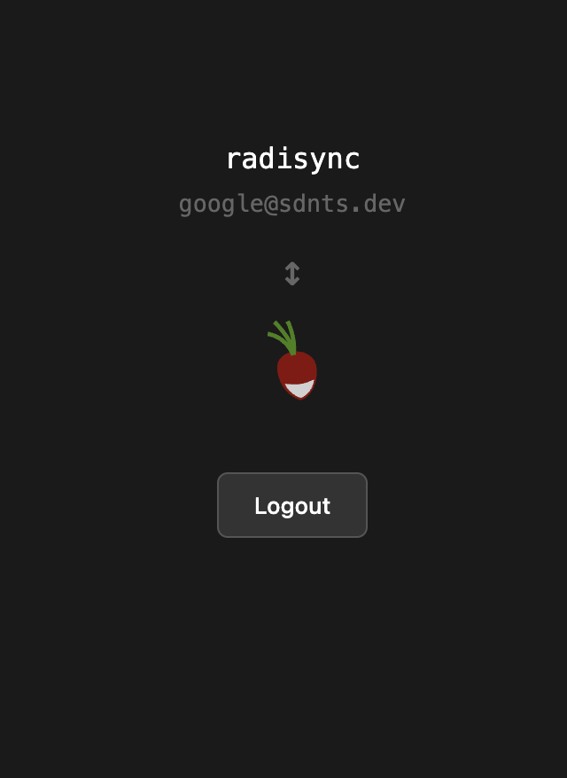

# Radisync

Bidirectional calendar sync between a self-hosted [Radicale](https://radicale.org/) CalDAV server and Google Calendar, running on Cloudflare Workers.

<p align="center">
  
  
</p>

## How it works

Two Cloudflare Workflows run on a cron schedule (every minute):
- **RadicaleToGoogle** - Syncs events from Radicale → Google Calendar
- **GoogleToRadicale** - Syncs events from Google Calendar → Radicale

The Radicale server is accessed via a Cloudflare VPC service binding (Beelink tunnel).

## Setup

1. **Install dependencies**
   ```sh
   yarn install
   ```

2. **Configure secrets**
   ```sh
   yarn wrangler secret put GoogleOAuthClientSecret
   ```

3. **Deploy**
   ```sh
   yarn wrangler deploy
   ```

4. **Authenticate** - Visit the deployed worker URL to connect your Google Calendar account.

## Development

```sh
yarn wrangler dev
```

## Configuration

| Variable | Description |
|----------|-------------|
| `GoogleOAuthClientId` | Google OAuth client ID |
| `GoogleOAuthClientSecret` | Google OAuth client secret (Wrangler secret) |
| `AppHost` | The deployed worker URL |

KV keys (set automatically after OAuth):
- `googleOAuthToken` - OAuth refresh token
- `googleCalendarId` - Target Google Calendar ID
- `googleSyncToken` / `radicaleSyncToken` - Incremental sync tokens
